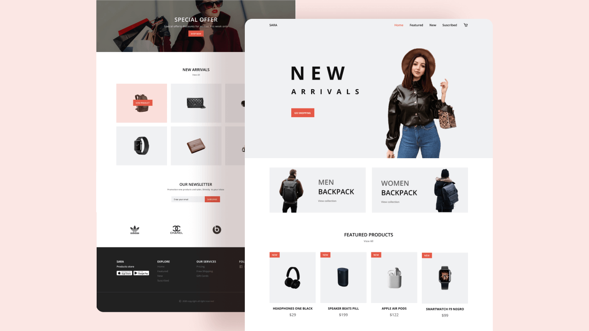

# Responsive E-Commerce Website

Welcome to the Responsive E-Commerce Website project! This project is a fully responsive e-commerce website designed to provide a seamless shopping experience. It features a modern design, smooth animations, and interactive elements. Below you will find an overview of the project's purpose, technologies used, and instructions for setup.

## Table of Contents

- [Project Overview](#project-overview)
- [Features](#features)
- [Technologies Used](#technologies-used)
- [Setup Instructions](#setup-instructions)
- [Credits](#credits)
- [Disclaimer](#disclaimer)

## Project Overview

The Responsive E-Commerce Website is designed to offer a visually appealing and user-friendly interface for an online store. The website highlights various products, showcases features, and offers easy navigation through sections like Home, Features, New Arrivals, and Contact.



## Features

- **Responsive Design**: Optimized for all screen sizes including mobile, tablet, and desktop.
- **Interactive UI**: Smooth animations and transitions to enhance user interaction.
- **Dynamic Content**: Displays various products with detailed descriptions and images.
- **Contact Form**: Easy to reach contact form for inquiries and feedback.

## Technologies Used

- **HTML5**: For structuring the content.
- **CSS3**: For styling the website, including Flexbox and Grid for layout.
- **JavaScript**: For adding interactivity and handling dynamic content.
- **ScrollReveal.js**: For scroll animations.

## Setup Instructions

1. **Clone the repository:**

   ```bash
   git clone https://github.com/Trailblazer-dev/responsive-ecommerce-website.git

## credits

This project was created with dedication and passion for web development. The assets used in this project, including images and icons, are sourced from various free resources and are credited accordingly within the project files.

In addition, I want to acknowledge the YouTube channel that helped me to build this project:**Bedimcode**.

## Disclaimer

The project is currently just a front-end implementation and lacks some features and functionality. However, over time, I plan to make it a fully functional web application.

Feel free to contribute, report issues, or suggest features to improve this project. Enjoy building and customizing your own responsive e-commerce website!
